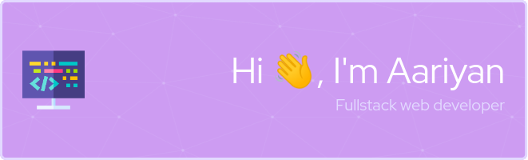

<div align="center">  </div>


<!--  Profile Information  -->
</br>
</br>

- 🔭 I’m currently working on [FawFlix (A NetFlix Clone )](https://fawflix.vercel.app/)

- 🌱 I’m currently learning **Next.js**

- 👨‍💻 All of my projects are available at [https://aariyanapu.com](https://aariyanapu.com)

- 💬 Ask me about **MERN, React, TypeScript**

- 📫 How to reach me **aariyan.apu@gmail.com**

</br>

---

</br>
<h2 align="center"> 💻 Tech Stack: </h2>
</br>

<p align='center'>

 
</p>

</br>

---

</br>
<h2 align="center"> 📊 GitHub Stats: </h2>

|       |        |
| -------------------- | :-----------------------: |
|                            |                                                |


<br/>
<h2 align="center"> Some Info about my Coding Life </h2>
<p > <a href="https://visitcount.itsvg.in" target="blank"></a></p>

<!--START_SECTION:waka-->


**I'm a Night 🦉** 

```text
🌞 Morning                88 commits          ██░░░░░░░░░░░░░░░░░░░░░░░   06.45 % 
🌆 Daytime                235 commits         ████░░░░░░░░░░░░░░░░░░░░░   17.22 % 
🌃 Evening                536 commits         ██████████░░░░░░░░░░░░░░░   39.27 % 
🌙 Night                  506 commits         █████████░░░░░░░░░░░░░░░░   37.07 % 
```
📅 **I'm Most Productive on Thursday** 

```text
Monday                   119 commits         ██░░░░░░░░░░░░░░░░░░░░░░░   08.72 % 
Tuesday                  127 commits         ██░░░░░░░░░░░░░░░░░░░░░░░   09.30 % 
Wednesday                216 commits         ████░░░░░░░░░░░░░░░░░░░░░   15.82 % 
Thursday                 296 commits         █████░░░░░░░░░░░░░░░░░░░░   21.68 % 
Friday                   168 commits         ███░░░░░░░░░░░░░░░░░░░░░░   12.31 % 
Saturday                 290 commits         █████░░░░░░░░░░░░░░░░░░░░   21.25 % 
Sunday                   149 commits         ███░░░░░░░░░░░░░░░░░░░░░░   10.92 % 
```


📊 **This Week I Spent My Time On** 

```text
💻 Operating System: 
Linux                    28 hrs 6 mins       █████████████████████████   100.00 % 
```

**I Mostly Code in JavaScript** 

```text
JavaScript               28 repos            ████████████████░░░░░░░░░   63.64 % 
HTML                     13 repos            ███████░░░░░░░░░░░░░░░░░░   29.55 % 
EJS                      2 repos             █░░░░░░░░░░░░░░░░░░░░░░░░   04.55 % 
CSS                      1 repo              █░░░░░░░░░░░░░░░░░░░░░░░░   02.27 % 
```


<!--END_SECTION:waka-->

<!-- Activity Graph  -->
   [](https://github.com/ashutosh00710/github-readme-activity-graph)


<div align="center">

| <a href="https://app.daily.dev/aariyanapu"></a> | [](https://stackoverflow.com/users/12180960/aariyan-apu)|
| ------- | ----- |

</div>


<div align="center">
<h2> I am obsess with : </div>

<a href="https://www.data-card-for-spotify.com/card?user_id=31tn6riohy27abhahkklkxmaigbu">
  
</a>


</div>


</br>
<h2 align="center"> 🌐 It would be awesome talk to you!  </h2>

|     |    |
| ------------ | :-------------------: |
| <a href="https://twitter.com/aariyanapu" target="blank"></a> | [](https://facebook.com/aariyan.apu) [](https://instagram.com/aariyan.apu) [](https://linkedin.com/in/aariyanapu) [](https://quora.com/profile/Aariyan-Apu) [](https://stackoverflow.com/users/12180960) [](https://twitter.com/aariyanapu) |


